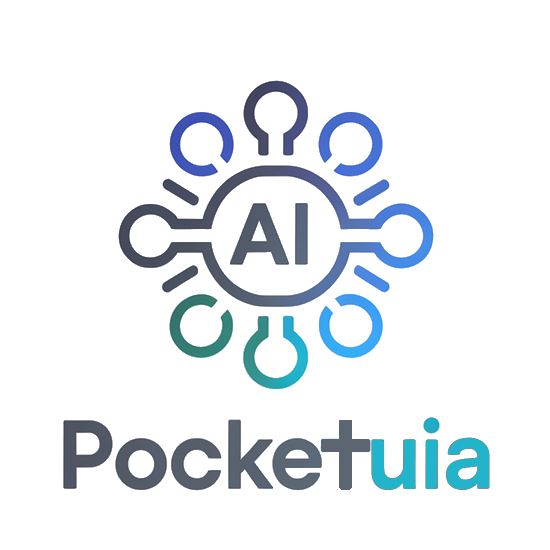
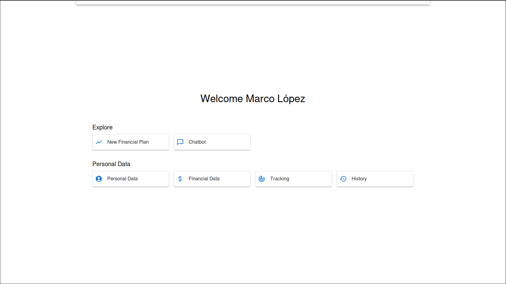
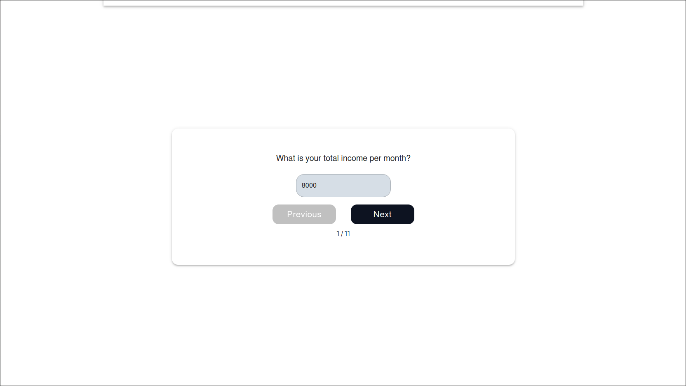
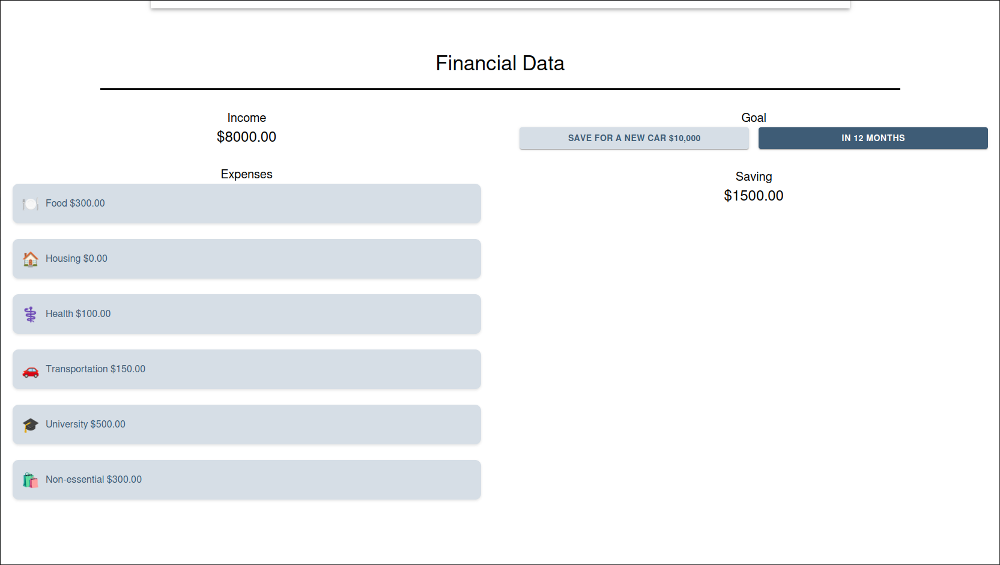
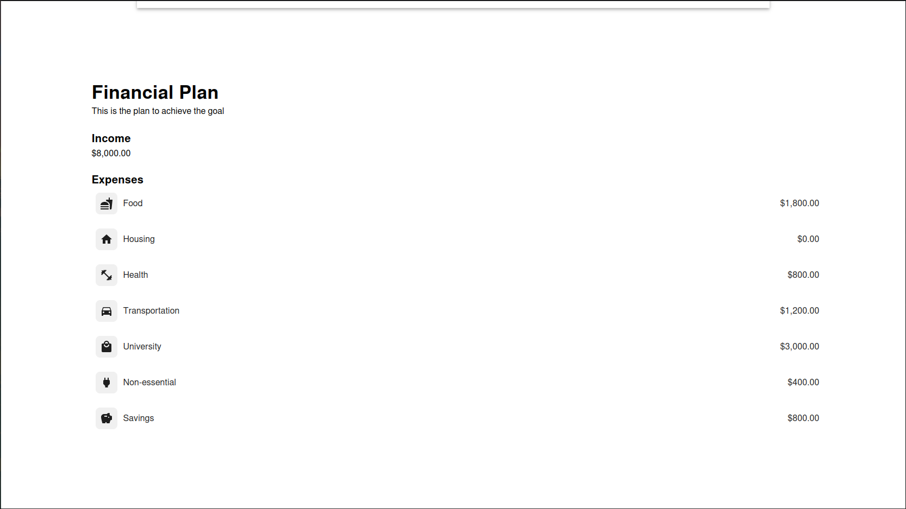
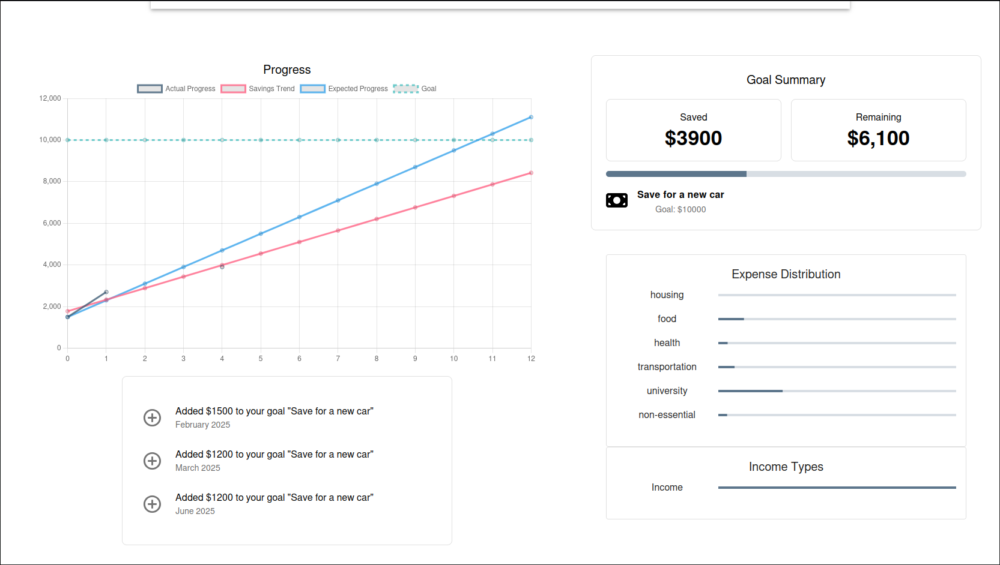
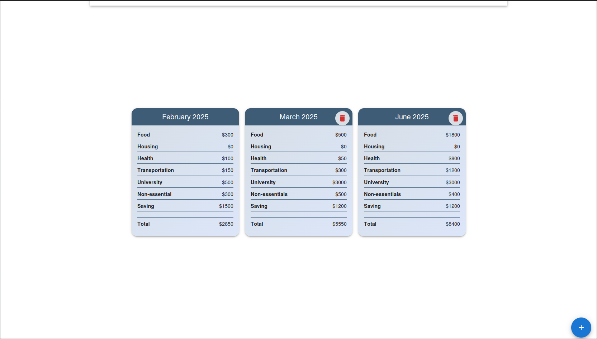

<div align="center">
  
</div>

## 📌 Description  

This is a web application featuring a financial assistant designed to help students achieve a financial goal (currently, saving a specific amount of money).  

### How It Works  
- The system uses a **Decision Tree model** to classify students into **12 different financial plans** based on their income and expenses.  
- Once assigned a plan, the user can adjust it to meet their savings goal within the desired period.  
- The platform also **tracks progress** and provides insights into spending habits, helping users manage their money effectively.  

### Experimental Features  
- An **Apriori algorithm** was implemented to generate association rules for user classification, but this feature remains in an experimental phase.  

### Data & Models  
- The model was trained using an online dataset, which was **preprocessed and structured** to improve performance.  
- All files related to data processing and model training can be found in the **"Models"** folder.  

## 🚀 Technologies Used  

### 🌐 Backend  
- [Django](https://docs.djangoproject.com/en/stable/) - Web framework for building scalable applications in Python.  
- [Firebase Admin](https://firebase.google.com/docs/admin/setup) - SDK for managing Firebase from the backend.  

### 💻 Frontend  
- [React](https://react.dev/) - Library for building interactive user interfaces.  
- [Vite](https://vitejs.dev/) - Fast and modern frontend build tool for web applications.  

#### 📦 React Libraries  
- [Material UI](https://mui.com/material-ui/getting-started/) - UI components with a modern design.  
- [Axios](https://axios-http.com/docs/intro) - HTTP client for making API requests.  
- [Chart.js](https://www.chartjs.org/docs/latest/) + [React Chart.js 2](https://react-chartjs-2.js.org/) - Data visualization with interactive charts.  
- [React Hot Toast](https://react-hot-toast.com/) - Lightweight toast notifications library.  
- [React Router DOM](https://reactrouter.com/home) - Routing management for React applications.  
- [Firebase Client](https://firebase.google.com/docs/web/setup) - SDK for integrating Firebase into the frontend.  
- [FontAwesome](https://docs.fontawesome.com/web/use-with/react) - Scalable and customizable icons.  

### 🐍 Python Libraries  
- [django-cors-headers](https://pypi.org/project/django-cors-headers/) - Handling CORS in Django.  
- [firebase-admin](https://firebase.google.com/docs/admin/setup) - SDK for managing Firebase from the backend.  
- [Jupyter Client](https://jupyter-client.readthedocs.io/en/stable/) - Client for interacting with Jupyter kernels.  
- [Matplotlib](https://matplotlib.org/stable/users/installing.html) - Data visualization in Python.  
- [NumPy](https://numpy.org/doc/stable/) - Library for numerical computations.  
- [Pandas](https://pandas.pydata.org/docs/) - Data manipulation and analysis.  
- [Scikit-learn](https://scikit-learn.org/stable/) - Machine learning library for Python.  

### ☁️ Services  
- [Firebase](https://firebase.google.com/docs) - Cloud platform for authentication and database services.  

## 🛠️ Installation  
Follow these steps to set up and run the project locally:

1. **Clone the repository**  
   Clone the project by running the following command:
   ```
   git clone https://github.com/B3rser/PocketUAI_Front.git
    ```

2. **Install Dependencies for React**  
    Open a terminal in the `./PocketUAI_Front` folder and run the following command to install the React project's libraries:
    ```
    npm install
    ```
    If needed, run the following command to fix any security vulnerabilities in the dependencies:
    ```
    npm audit fix
    ```
3. **Set up a virtual environment for Python**  
    Install the `virtualenv` library to create virtual environments and isolate the project dependencies:
    ```
    pip install virtualenv
    ```
    Create a virtual environment with the following command (you can do it anywhere, but it is recommended to place it at the level of the `PocketUAI_Back` and `PocketUAI_Front` folders):
    ```
    python -m venv venv
    ```
    Run the following command to activate the virtual environment in your terminal (this might vary depending on your operating system):  
    * On macOS/Linux:
    ```
    source venv/bin/activate
    ```
    * On Windows:
    ```
    venv\Scripts\activate
    ```
4. **Install dependencies for Django**  
    Open a terminal in the `./PocketUAI_Back` folder and run the following command to install the required libraries for the Django project in the virtual environment:
    ```
    pip install -r requirements.txt
    ```

3. **Configure Firebase Credentials**  
    Both the backend and frontend require a `.env` file to configure Firebase access keys. First, you need to create a Firebase project:

    - [Firebase documentation: Create a project](https://firebase.google.com/docs/web/setup#create-project)

    #### Backend Setup:
    For the backend, you will need a `.json` file provided by Firebase that contains the access keys for Firebase Admin SDK. Follow these steps to obtain the credentials:

    - [Firebase documentation: Obtain the Admin SDK credentials](https://firebase.google.com/docs/admin/setup#initialize_the_sdk_in_non-google_environments)

    Once you have the file, place it in the `./PocketUAI_Back` folder. Then, create a `.env` file in the same folder and include the following line:

    ```
    FIREBASE_CREDENTIALS_PATH=./NAME_JSON
    ```

    The `NAME_JSON` file should look like something like `pocketuai-firebase-adminsdk-*.json`, based on the credentials file you obtained.

    #### Frontend Setup:  
    For the frontend, you need Firebase Client SDK keys. To get these, follow this guide:

    - [Firebase documentation: Register an app](
    https://firebase.google.com/docs/web/setup#register-app)

    Once registered, create a `.env` file in the `./PocketUAI_Front` folder and include the following Firebase keys:

    ```
    VITE_FIREBASE_API_KEY=FIREBASE_API_KEY
    VITE_FIREBASE_AUTH_DOMAIN=FIREBASE_AUTH_DOMAIN
    VITE_FIREBASE_PROJECT_ID=FIREBASE_PROJECT_ID
    VITE_FIREBASE_STORAGE_BUCKET=FIREBASE_STORAGE_BUCKET
    VITE_FIREBASE_MESSAGING_SENDER_ID=FIREBASE_MESSAGING_SENDER_ID
    VITE_FIREBASE_APP_ID=FIREBASE_APP_ID
    ```

    Each of these values can be found in the Firebase console after registering the app. These environment variables are necessary to configure Firebase on both the backend and frontend.

    That's all you need to configure the environment variables for both the backend and frontend.

6. **Run the Project**  
    To run the project locally, follow these steps:

    #### Frontend:
    1. Navigate to the `./PocketUAI_Front` folder.
    2. Run the following command to start the frontend:

    ```
    npm run dev
    ```
    #### Backend:
    1. Navigate to the `./PocketUAI_Back` folder.
    2. Run the following command to start the backend:
    ```
    python manage.py runserver
    ```
    Make sure to run the backend first, then start the frontend. This ensures that everything loads correctly.

    Once both the backend and frontend are running, you can access the web page at the following URL:

    http://localhost:5173/

## Usage 🔄

Below are the views available in the application:

#### 1. Home View 🏠
The **Home View** is the main page where you can navigate through the different features of the financial assistant.

<div align="center">
  
</div>

#### 2. New Plan View 📝
The **New Plan View** allows you to create a financial plan based on your income and expenses. Here, you can set your savings goal and receive a financial plan.

<div align="center">
  
</div>

#### 3. Info User View 👤
The **Info User View** displays the user's personal information and financial data. 

<div align="center">
  
</div>

#### 4. Plan View 📈
The **Plan View** shows your detailed financial plan, it provides a clear breakdown of how to allocate your income in order to reach your goal efficiently.

<div align="center">
  
</div>

#### 5. Tracking View 📊
The **Tracking View** helps you monitor your progress towards your financial goal, showing updates on your savings and expenses.

<div align="center">
  
</div>

#### 6. History View 📜
The **History View** lets you review your past financial plans and progress, so you can keep track of your achievements over time. Additionally, it lets you record how well you did during a given month.

<div align="center">
  
</div>
